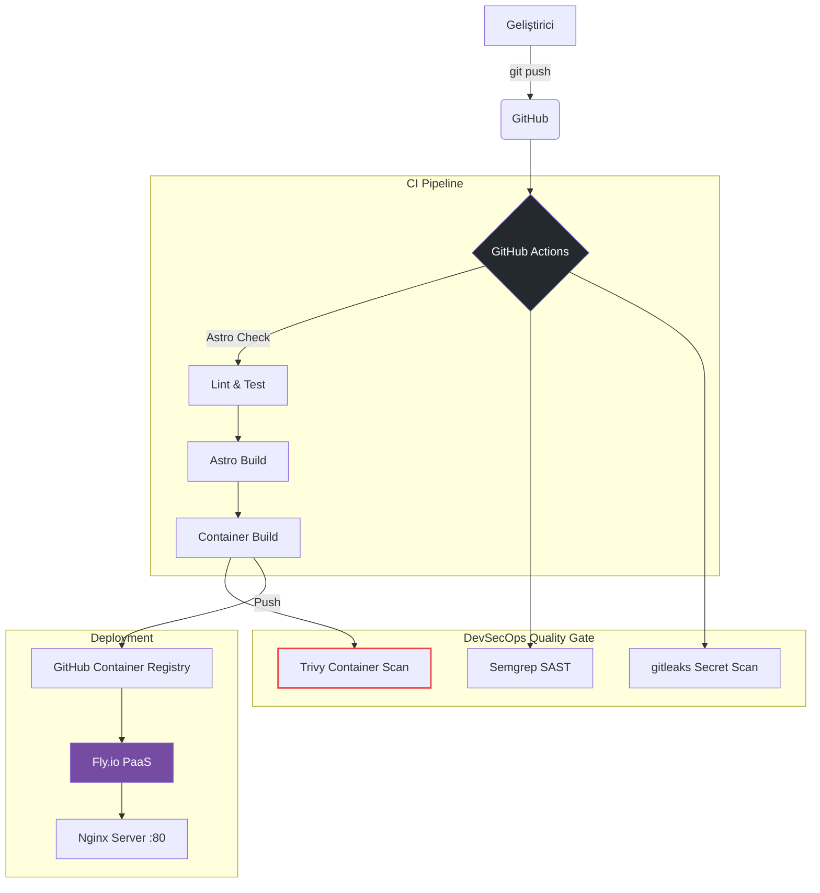

<div align="center">
  
  <h1>Hanım ATAŞ — Kişisel Portföy</h1>
  <h3>Öğrenci No: 24080410032</h3>
  
  <p>
    <strong>Backend Developer & DevOps Engineer</strong><br>
    Yeni nesil, yüksek performanslı ve tamamen otomatize edilmiş kişisel portföy platformu.
  </p>

  <p>
    <a href="https://github.com/HANIM23-ATAS/portfolyo/actions/workflows/ci.yml">
      
    </a>
    <a href="https://github.com/HANIM23-ATAS/portfolyo/actions/workflows/security.yml">
      
    </a>
  </p>
</div>

---

## 🚀 Proje Hakkında

Bu proje, bir backend geliştiricisinin yeteneklerini "sadece anlatmak" yerine "gösterdiği" uçtan uca modern bir web platformudur. Portföy, sadece statik bir web sitesi olmakla kalmaz; aynı zamanda production-grade bir Kubernetes/DevOps mimarisi kültürünü barındırır.

### ✨ Öne Çıkan Özellikler

- **Mükemmel Performans:** Astro'nun "Zero-JS" mimarisi ile Vanilla CSS kullanarak Google Lighthouse'da üst seviye skor.
- **Kişisel Dokunuş:** Dürüst yetenek değerlendirmeleri, github profil bağlantıları, güncel iletişim formları ve detaylı özgeçmiş.
- **Micro-image Container:** Nginx tabanlı multi-stage Docker build yapısı sayesinde imaj boyutu ~30MB sınırlarına çekilmiştir.
- **DevSecOps Entagrasyonu:** GitHub Actions üzerinde CI/CD pipeline, Trivy ile container zaafiyet taraması, Semgrep ile SAST ve Gitleaks ile secret detection.
- **Production Hijyeni:** Reverse proxy (Nginx) üzerinde aktif healthcheck, structured JSON loglama ve güvenlik header yapılandırması.

---

## 📐 Mimari 

Aşağıdaki diyagram CI/CD ve dağıtım sürecini göstermektedir:



---

## 🛠️ Kurulum ve Çalıştırma

Projede Docker kullanılarak kolay kurulum hedeflenmiştir. 

### Ön Koşullar
- Docker Desktop veya Docker Engine
- Docker Compose v2+

### Adımlar

1. Depoyu klonlayın:
   ```bash
   git clone https://github.com/HANIM23-ATAS/portfolyo.git
   cd portfolyo
   ```

2. Konteynerleri başlatın:
   ```bash
   docker compose up --build -d
   ```

3. Web sitesini açın:
   [http://localhost:8080](http://localhost:8080) adresini ziyaret ederek projenizi inceleyebilirsiniz.

4. Container durumunu ve logları görüntülemek için:
   ```bash
   docker ps
   docker compose logs -f
   ```

---

## 🎬 Demo Video & İspatlar

Jürinin projenin çalışabilirliğini görmesi için hazırlanan 5 dakikalık sunum videosuna aşağıdan ulaşabilirsiniz (Ayrıca repo içerisindeki ispatlar için Actions sekmesine bakılabilir):

🔗 **[Demo Video Linki Buraya Eklenecek]**

*(Not: Mülakat gereksinimlerindeki G5 - "Yapay Bug/Zafiyet (Red Pipeline)" gösterimi bu videoda yer almaktadır. Kendi testinizi yapmak isterseniz [SECURITY_TEST_GUIDE.md](SECURITY_TEST_GUIDE.md) dosyasını inceleyebilirsiniz.)*

---

## 📊 Observability (Gözlemlenebilirlik)

- Platform üretim (production) aşamasına geçtiğinde **Better Stack** ile izlenmeye uygun altyapıda geliştirilmiştir. Sağlık kontrolü yapılabilen bir `/health` endpoint'ine sahiptir.
- Ciddi duruşlarda alert (uyarı) sistemi hazır yapıdadır.
- Detaylar için projedeki [OBSERVABILITY.md](OBSERVABILITY.md) dosyasına göz atabilirsiniz.

---

## 🤖 AI Kullanım Beyanı

Bu projede kod üretim sürecini hızlandırmak, tekrarlayan sistem ve Docker yapılandırma gereksinimlerini profesyonel kalitede standardize etmek amacıyla Yapay Zeka destekli "pair programmer" yetenekleri kullanılmıştır. Mimarinin kurgulanması, kişisel deneyimlerin ifade biçimi ve genel hedefler bana aittir.

<p align="center">
  <b>Hanım ATAŞ</b> tarafından ❤️ ile geliştirilmiştir.
</p>
